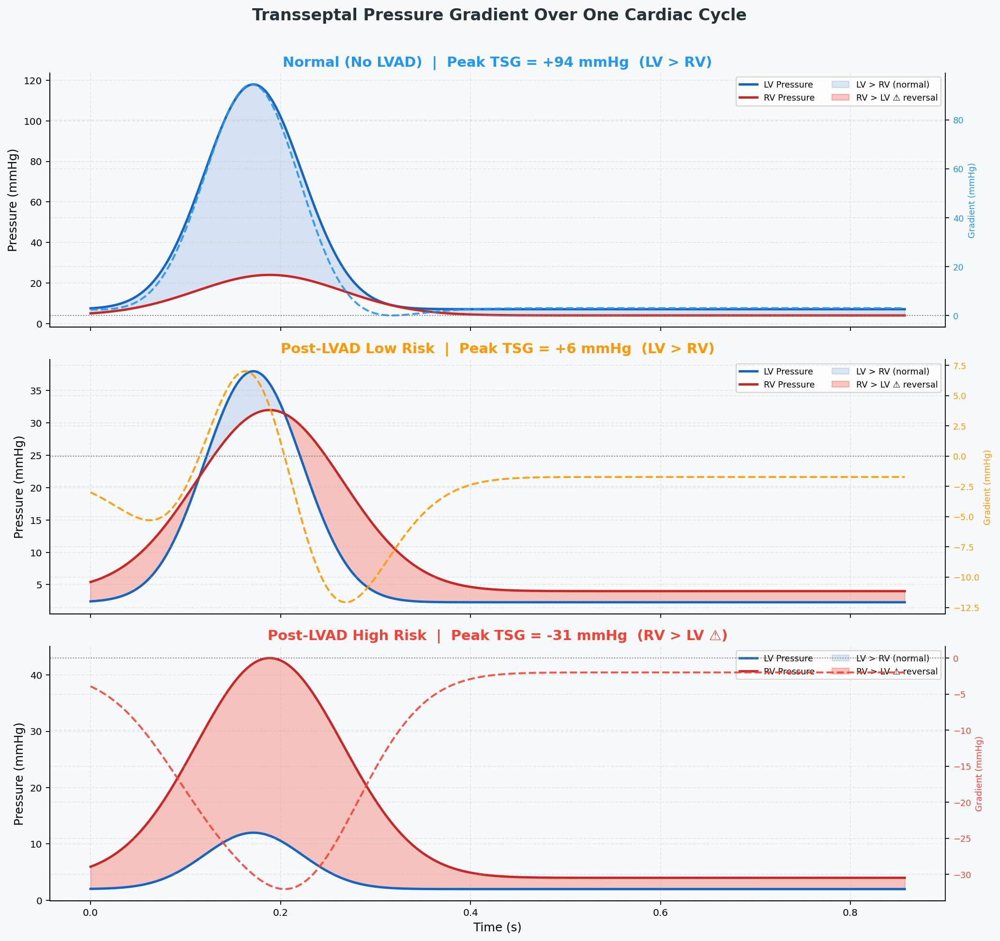
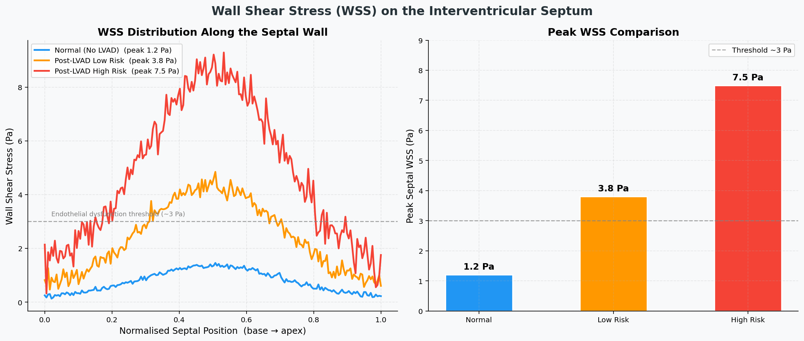
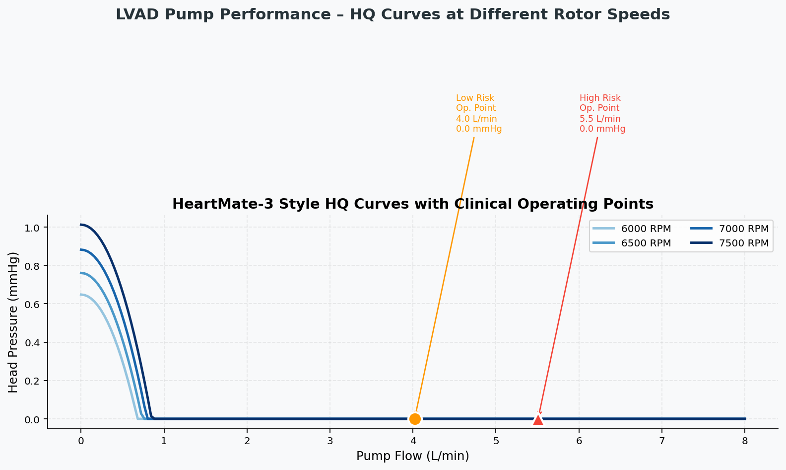
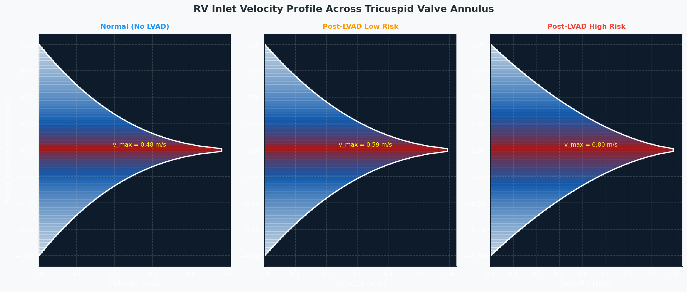
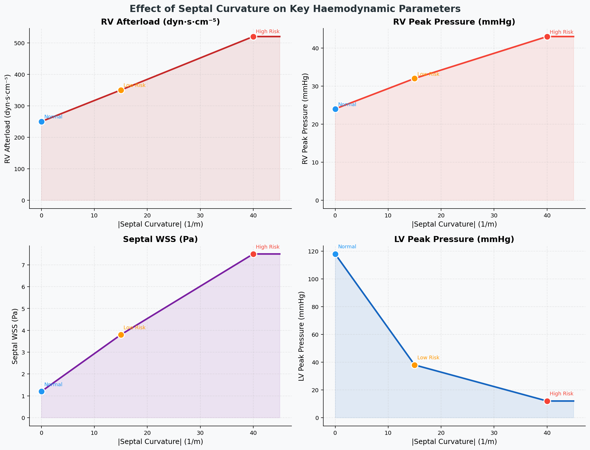
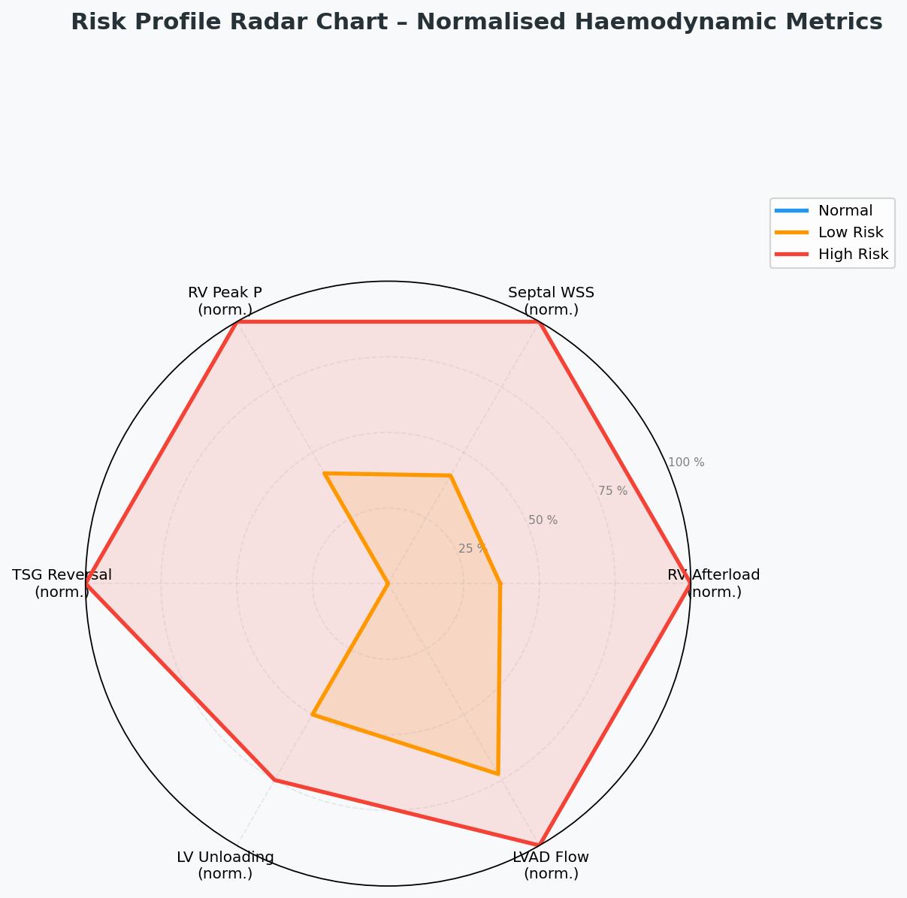
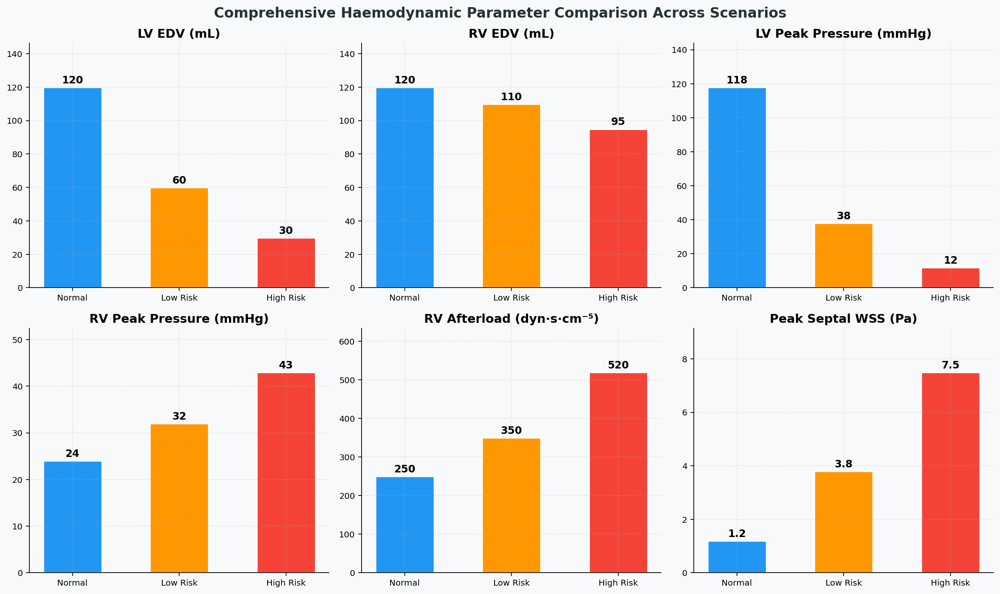
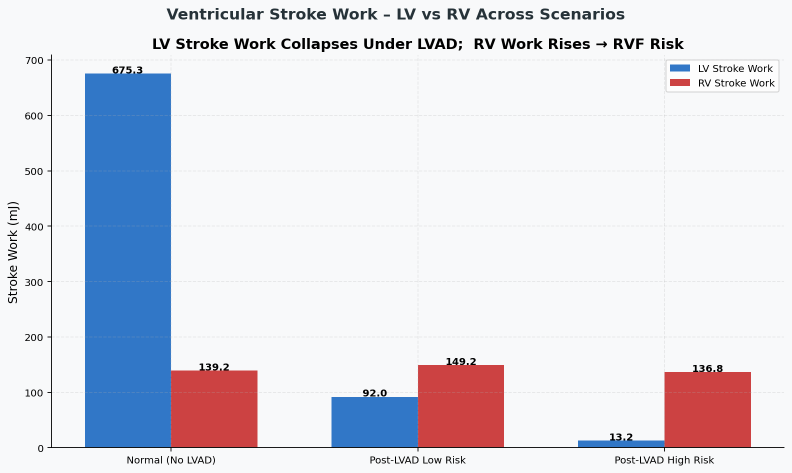

# Biventricular Interdependence & LVAD-Induced RVF Risk Simulation

A computational model of how a Left Ventricular Assist Device (LVAD) affects
both sides of the heart — and why pumping too aggressively can trigger
Right Ventricular Failure (RVF), one of the leading causes of post-LVAD mortality.

Built as part of the **Cardiovascular & Respiratory Mechanics** course project
at **IIT Madras**.
Authors: Shristy Roy `MD24B034` · Kripa Mariam Roy `MD24B032`

---

## The Clinical Problem

An LVAD is a mechanical pump implanted in patients with end-stage heart failure.
It takes over the left ventricle's job — drawing blood out and pushing it into
the aorta. This saves lives, but creates a hidden danger.

The heart's two ventricles share a common wall: the **interventricular septum**.
Normally, the left ventricle (LV) has higher pressure than the right (RV),
so the septum bows slightly leftward. When an LVAD aggressively unloads the LV,
pressure on the left drops sharply. The septum shifts further left, compressing
the RV and increasing its workload. If the RV can't cope — it fails.
This cascade is **LVAD-induced Right Ventricular Failure**.

This simulation models that cascade across three clinical scenarios:

| Scenario | LVAD Flow | What it represents |
|---|---|---|
| Normal (No LVAD) | 0 L/min | Healthy biventricular baseline |
| Post-LVAD Low Risk | 4.0 L/min | Safe LV unloading, mild septal shift |
| Post-LVAD High Risk | 5.5 L/min | Over-pumping, severe septal shift, RVF risk |

---

## What the Simulation Models

### Core Physics — Biventricular Coupling Matrix

The model is a **0D lumped-parameter cardiovascular system** — each cardiac
chamber is treated as a pressure-volume compartment governed by time-varying
elastance. This is the same framework used in published LVAD haemodynamics
literature (Chivukula et al.).

The two ventricles don't behave independently. They share the septal wall,
so a pressure change in one directly affects the other.
This is captured by the **septal coupling matrix**:

```
P_LV = [E_LV(E_RV + E_sep) · v_LV  +  E_LV · E_RV · v_RV] / denom
P_RV = [E_RV(E_LV + E_sep) · v_RV  +  E_LV · E_RV · v_LV] / denom

denom = E_LV·E_RV + E_LV·E_sep + E_RV·E_sep
```

where `E_LV`, `E_RV` = time-varying ventricular elastances,
`E_sep` = septal stiffness, `v` = volume above unstressed volume.

### LVAD Pump Model

Based on the HeartMate-3 head-flow relationship
(simplified Euler turbomachinery equation):

```
H = a·N² − b·Q²
```

where `N` = rotor speed (RPM), `Q` = pump flow (L/min).

### Stroke Work

```
SW = mean_pressure × stroke_volume
   = [(P_peak + P_edp) / 2] × (EDV − ESV)
```

Converted from mmHg·mL to mJ for clinical interpretability.

---

## Simulation Parameters

All values sourced from Tables 1 & 2 of Chivukula et al.:

| Parameter | Normal | Low Risk | High Risk |
|---|---|---|---|
| LV EDV (mL) | 120 | 60 | 30 |
| RV EDV (mL) | 120 | 110 | 95 |
| LV Peak Pressure (mmHg) | 118 | 38 | 12 |
| RV Peak Pressure (mmHg) | 24 | 32 | 43 |
| Transseptal Gradient (mmHg) | **+94** | +6 | **−31** |
| Septal Curvature (1/m) | 0 | −15 | −40 |
| RV Afterload (dyn·s·cm⁻⁵) | 250 | 350 | 520 |
| Peak Septal WSS (Pa) | 1.2 | 3.8 | 7.5 |
| LVAD Flow (L/min) | 0 | 4.0 | 5.5 |

The transseptal gradient sign flip — from **+94 mmHg to −31 mmHg** — is the
clearest single marker of RVF risk. When RV pressure exceeds LV pressure,
the septum is bowing the wrong direction.

---

## Output Figures

### 01 — Transseptal Pressure Gradient Over One Cardiac Cycle



LV and RV pressure waveforms across one cardiac cycle for all three scenarios.
The shaded region flips from **blue** (LV > RV, normal) to **red** (RV > LV,
reversal) in the high-risk case. The dashed secondary axis shows the
transseptal gradient crossing zero — the RVF danger line.

---

### 02 — Wall Shear Stress on the Interventricular Septum



Spatial WSS distribution along the septum (base to apex) and peak WSS
bar comparison. Septal WSS escalates **6× from 1.2 Pa to 7.5 Pa** under
high-risk LVAD speeds — crossing the ~3 Pa endothelial dysfunction threshold.
Chronic exposure at these levels risks irreversible septal wall remodelling.

---

### 03 — LVAD Pump HQ Performance Curves



HeartMate-3 style head-flow curves from 6000 to 7500 RPM with clinical
operating points marked for low and high risk scenarios. Shows the core pump
tradeoff: higher RPM increases flow but reduces head pressure — the shift
that drives RVF risk when speed is set too aggressively.

---

### 04 — RV Inlet Velocity Profiles (Tricuspid Valve)



Power-law velocity profiles across the tricuspid valve annulus.
As RV afterload rises (250 → 520 dyn·s·cm⁻⁵), the inflow jet sharpens
from near-parabolic to a narrow central jet. Higher afterload drives faster
inflow to maintain cardiac output — a compensatory mechanism that eventually
exhausts the RV.

---

### 05 — Effect of Septal Curvature on Haemodynamics



Continuous interpolation of four key parameters across the full septal
curvature range (0 to −45 1/m). As the septum shifts progressively leftward,
RV afterload and WSS climb while LV pressure collapses — the complete
haemodynamic fingerprint of LVAD-induced RVF developing in slow motion.

---

### 06 — Radar Risk Profile



Six normalised risk dimensions on a polar chart. Each axis is one
haemodynamic risk marker scaled to [0, 1]. The high-risk scenario fills
the radar almost entirely — showing that over-pumping deteriorates every
parameter simultaneously, not just one.

---

### 07 — Haemodynamic Summary Comparison



Side-by-side bar comparison of all six key metrics across the three scenarios.
Two changes dominate: LV peak pressure collapsing from 118 → 12 mmHg, and
RV afterload nearly doubling from 250 → 520 dyn·s·cm⁻⁵.

---

### 08 — Stroke Work: LV vs RV



As the LVAD assumes LV pumping duty, LV stroke work collapses. Simultaneously,
RV stroke work rises as the RV faces increased afterload with less and less
septal support. The crossover point where RV work can no longer be sustained
is the RVF tipping point.

---

## Key Clinical Findings

```
Transseptal gradient reversal :  +94 mmHg  →  −31 mmHg  (sign change = danger)
Septal WSS escalation         :   1.2 Pa   →   7.5 Pa   (6× increase)
RV afterload rise             :   250      →   520 dyn·s·cm⁻⁵  (~2×)
LV peak pressure drop         :   118 mmHg →   12  mmHg  (90% collapse)
LV stroke work                :  collapses as LVAD assumes LV workload
RV stroke work                :  rises → approaches failure tipping point
```

The simulation demonstrates why LVAD speed optimisation is a critical clinical
decision. The difference between 4.0 L/min and 5.5 L/min pump flow is the
difference between safe haemodynamic support and triggering a cascade toward RVF.

---

## How to Run

```bash
git clone https://github.com/Shristy-byte/lvad-biventricular-model.git
cd lvad-biventricular-model
pip install -r requirements.txt
python lvad_simulation_v2.py
```

All 8 figures are saved automatically to `lvad_outputs/`.
Runtime is under 10 seconds on any modern CPU.

---

## Project Structure

```
lvad-biventricular-model/
├── lvad_simulation_v2.py        ← full simulation + all 8 plots
├── requirements.txt
├── lvad_outputs/
│   ├── 01_Transseptal_Gradient.png
│   ├── 02_Wall_Shear_Stress.png
│   ├── 03_LVAD_HQ_Curves.png
│   ├── 04_Velocity_Profiles.png
│   ├── 05_Curvature_Effects.png
│   ├── 06_Radar_Risk_Profile.png
│   ├── 07_Summary_Comparison.png
│   └── 08_Stroke_Work.png
└── README.md
```

---

## Requirements

```
numpy
matplotlib
scipy
```

```bash
pip install -r requirements.txt
```

---

## References

- Chivukula VK et al. — Computational haemodynamic analysis of LVAD-induced
  septal shift and RVF risk (primary data source, Tables 1 & 2)
- Krabatsch T et al. — HeartMate-3 clinical pump performance data
- Burkhoff D et al. — Pressure-volume analysis in heart failure and
  mechanical circulatory support
- Mehra MR et al. — Right ventricular failure after LVAD implantation:
  clinical predictors and management strategies
